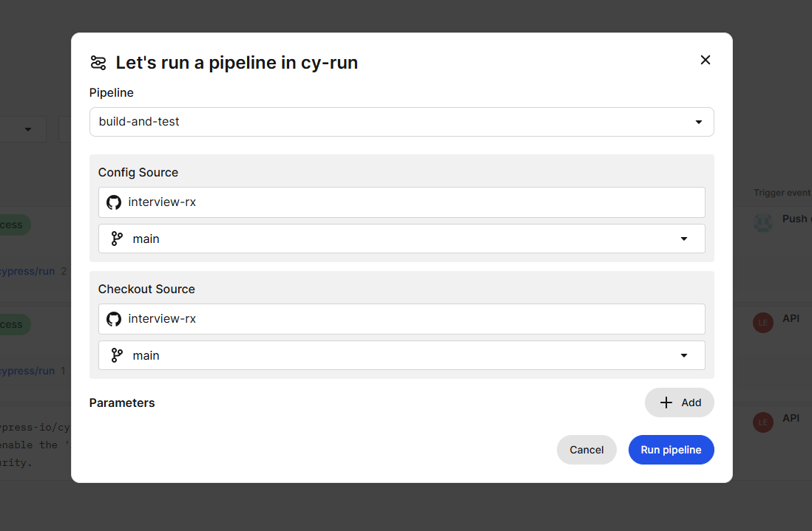
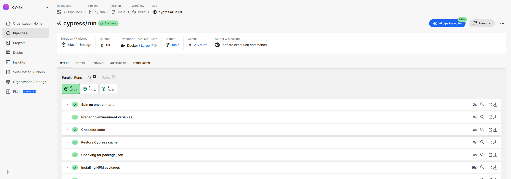
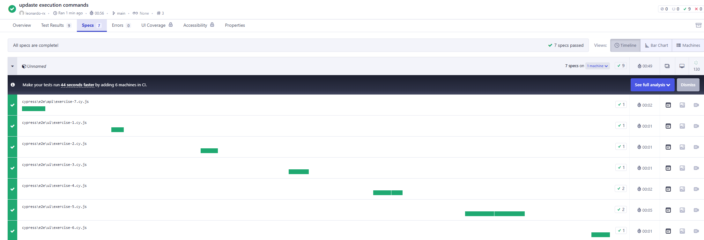
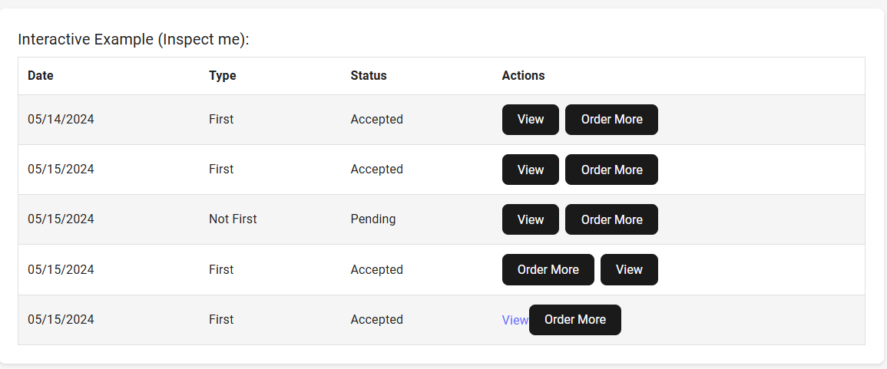

# QA Challenge - Cypress Tests


This project was created as part of a technical assessment for the company RX Redefiined.
Throughout the project, 7 exercises were completed in order to validate specific skills related to test automation using Cypress.

**Throughout all exercises, beforeEach is used to guarantee consistent access to the website and maintain the correct exercise context across all scenarios.**

## Approach Documentation

**See below each completed exercise and the approach taken for each one:**

* Exercise 1: Find Product with Specific Price
  * After locating the product list and confirming we are on the `product-item` element, instantiate two variables to store the product session values. Once these are set, return the product data that matches the requested value.

<!-- pagebreak -->

* Exercise 2: Find Table Elements
  *  Here I had to change `contains to filter` because, for some reason, Cypress wasn't able to find all the elements in the table using `contains`. It was also necessary to make a change to `moment.tz` to use a static date instead of a dynamic one.
  * Using `within`, I can access all elements inside the table and then interact with them according to their respective indices using their index positions.
  * This is my first time interacting with elements in a table, so I believe there's room for improvement and to implement a more dynamic way of retrieving its items.

<!-- pagebreak -->

* Exercise 3: Verify Checkbox State
  * After selecting all elements with the `data-cy` attribute referencing the grid, I use the `.item-content` class to validate whether the lang attribute I’m looking for is present. I then use `.parents()` to ensure these elements are nested within the `.item-content` hierarchy.
  * Once these items are validated, I can verify the item type and its status: checked or unchecked.

<!-- pagebreak -->

* Exercise 4: Element Relations
  * Verify old car element
    * After performing a basic search for the parent element in the DOM, I use .contains to ensure "old car" exists within the <span> and .should('exist') to verify the element's existence.
    * An alternative would also be to check if the element is visible, using .should('be.visible').

  * Verify if number 1 has a sibling with old-card
    * I use .siblings() to find the sibling element with the text "old-car" and use .contains to verify if the 1 exists within the <span> element.
  
<!-- pagebreak --> 

* Exercise 5: Login Command
  * My goal in creating a constant from data coming from a JSON object is to simulate something as close as possible to a database.
  * By creating a constant, I have the ability to combine data in various formats without depending on how they come from the source to increase the flexibility and data coverage in the tests.
  * After configuring the custom commands file in `cypress.config.js` and importing the command class, I implement the creation of a custom command.
  * Within this class, I define the user command, which accepts two parameters: email and password.
  * Next, I create the basic logic for data input using `type()`, leveraging `data-cy` selectors to ensure precise element identification.
  * Finally, I execute the login action with `click()` and validate the operation’s success by checking the visibility of the "Welcome Back" message using `should('be.visible')`.
  * Afterwards, in my main test execution class, I can instantiate new objects and perform validations by passing the user object as a parameter within the custom commands.

<!-- pagebreak -->

* Exercise 6: Product Selection
  * Using `cy.get`, I select the `.product-card` element which contains all products and verify the presence of the desired item via the `.contains()` method, ensuring it exists within the parent class hierarchy.
  * Next, I locate the "Add" button using the `[data-cy="adicionar-item"]` selector and perform the click action with `click()`.

<!-- pagebreak -->

* Exercise 7: API Interception
  * Linked to `cy.intercept`, I perform two validations: I ensure that the request body contains the necessary values, and then I confirm that these values were actually sent. Using a callback function, I check if the response has the id property, and after that, I perform the `POST` request that should be intercepted.


## How to execute the project

#### Install dependencies
```npm install```

<!-- pagebreak -->

#### Execution via Cypress Web
To execute via Cypress Web App, run the command below
<!-- pagebreak -->

``` npx cypress open ```

<!-- pagebreak -->

#### Execution via Terminal
Local
<!-- pagebreak -->

```npx cypress run```

Local execution with output of results to the Cypress Dashboard
<!-- pagebreak -->

```npx cypress run --record --key 7e7c9ff4-ca24-4ed6-92b6-5bd7f4f4cdad```
<!-- pagebreak --->

#### Build execution using CircleCI
Using the credentials sent by email, make login on Circle CI using https://auth.circleci.com/u/login and acess `cy-rx` organization and select the `cy-run` pipeline by clicking on Pipelines in the card.
After accessing the pipeline summary, click on **Trigger Pipeline**, and in the **Config Source and Checkout Source sections, select the Main branch**.
Then, execute the pipeline by clicking **Run Pipeline**.

In the configuration file related to CircleCI, the parallelism property was used to improve performance during test execution.
Since this is a small project, the impact may not be significant, but this is an important parameter for larger projects.





## How to see executions reports
Using the credentials sent by email, access https://cloud.cypress.io/login and make login with email.
After this, Click on Project and access the cy-run-rx project. The reports will appear if:

  * The project is run locally using the parameter --key 7e7c9ff4-ca24-4ed6-92b6-5bd7f4f4cdad
  * A new push is made to the project's main branch, which will trigger an automatic run via CircleCI
  * It is executed manually via the CircleCI CLI



#### Bug report
In the second test section, there are two defects present in the table component:

1. The order of the Order More and View buttons is different between the last and second-to-last items in the table.

2. In the last item of the table, the View button has a broken css style.

